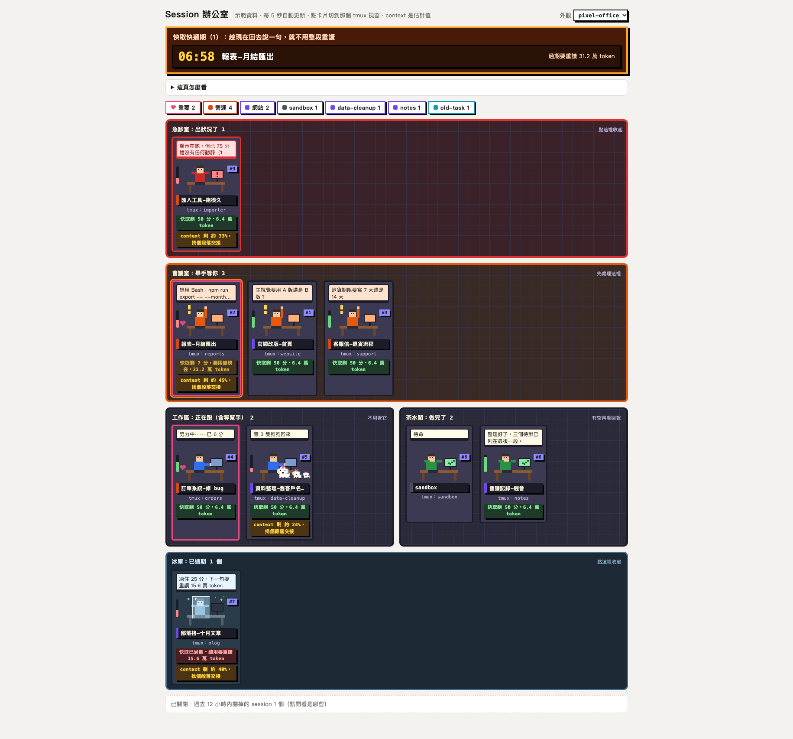
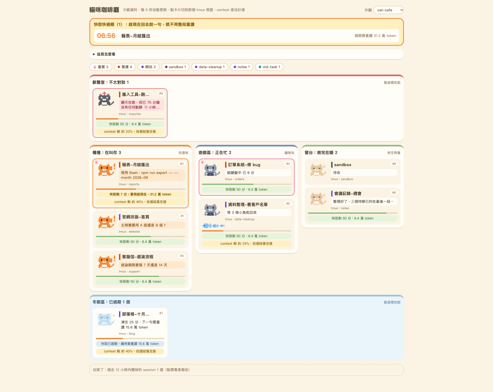

# session-office

把這台電腦上每個 Claude Code session 畫成一間辦公室：誰在等你、誰在跑、誰做完了、誰出狀況，一眼看完。點卡片直接切到那個 tmux 視窗。

長相可以換。判斷邏輯大家共用一份，長相各做各的「外觀包」。

| 像素辦公室（預設） | 貓咪咖啡廳（範例外觀包） |
|---|---|
|  |  |

兩張圖是同一份示範資料，只換了外觀包。

## 解決什麼問題

同時開十幾個 Claude Code session 之後，最貴的不是 token，是「有一個在等你回答，你不知道」。
辦公室把 session 分進幾個房間：

| 房間 | 誰在裡面 | 你要做什麼 |
|---|---|---|
| 會議室 | 停下來等你回答或授權的 | 先處理 |
| 工作區 | 正在跑、或在等派出去的 agent 回來的 | 不用管 |
| 茶水間 | 做完了、只是回報 | 有空再看 |
| 急診室 | 卡住、當掉、停在錯誤訊息的 | 點開看是誰 |
| 冰庫 | 做完了而且快取已過期的 | 回去用就解凍 |

另外兩件事會主動提醒：

- **快取快過期**：對話內容會暫存一段時間，期間內接著聊很便宜；過期後下一句要整段重讀。剩不到 10 分鐘會在最上面倒數。
- **context 快滿**：剩 50% 以下提醒找個段落交接，15% 以下建議先交接再清空。

## 安裝

```
/plugin marketplace add adchengzhi7/claude-skills
/plugin install session-office
```

然後跟 Claude 說「開 Session 辦公室」。也可以自己跑：

```
python3 run.py            # 開在 http://127.0.0.1:8765
python3 run.py --demo     # 先用示範資料看看長怎樣（不讀任何真實對話）
```

需要的東西：

| | 必要嗎 | 沒有會怎樣 |
|---|---|---|
| macOS 或 Linux、Python 3.9 以上 | 必要 | 只用 Python 內建的東西，不用另外裝套件。**不支援原生 Windows**（程式會拒絕啟動；WSL 裡可以跑，但沒實測過） |
| Claude Code | 必要 | 要新到會把每個 session 的狀態寫在 `~/.claude/sessions/`（實測 2.1.281）。太舊的話辦公室會直接告訴你找不到 |
| tmux | 選配 | 沒有的話卡片照樣顯示，只是點不過去 |
| Moshi | 選配 | 見下面 |

### Moshi 是選配

辦公室本身不需要 Moshi。有裝的話會自動偵測，用它的「context 還剩幾 %」（那是 Claude Code 直接給的數字）；
沒裝就從對話紀錄自己估。作者機器上 21 個 session 逐一比對了兩次，18～19 個差距在 1 個百分點內；差比較多的都是正在跑或剛停下來等回答的 session（Moshi 的數字只在送出與停下時更新，比較舊）。
這個比對只在「全部都是 100 萬上限」的機器上做過；如果你的 session 有 20 萬和 100 萬混用，估計值可能不準，可以在設定裡寫死 `contextWindow`。

## 換成自己的風格

跟 Claude 說「幫我做一個 ○○ 風格的外觀包」（例：水族箱、太空站、極簡文字版）。它會照 [THEMES.md](THEMES.md) 做：
複製一個內建外觀包到 `~/.config/session-office/themes/<名字>/`，改裡面的 `theme.css`（顏色、排法）和 `theme.js`（小人、用語）。

- 你的外觀包放在 `~/.config/session-office/themes/`，辦公室更新時不會被蓋掉。
- 頁面右上角可以切換外觀；改檔存檔後頁面會自己重新載入。
- 外觀包只管長相和用語。誰進哪個房間的判斷在共用的那一份，換外觀不會換掉判斷。

## 設定（選配）

`~/.config/session-office/config.json`，沒有這個檔就全部用預設值。範例見 [config.example.json](config.example.json)。

| 欄位 | 用途 | 預設 |
|---|---|---|
| `groups` | 分組：篩選鈕和名牌色塊。`match` 是不分大小寫的正規表示式，先比對資料夾與名字，再比對對話 | 沒設就用資料夾名分組 |
| `mark` | 特別標記：符合的卡片多一個小圖示（像素辦公室是愛心） | 無 |
| `ballPhrases` | 最後一句回報用這些字開頭＝「球在你這裡」，放進會議室 | 無 |
| `theme` | 預設外觀包 | `pixel-office` |
| `contextWindow` | `"auto"` 或數字（例 `200000`） | `"auto"` |
| `port` | 網址的 port | `8765` |

設定改完不用重開（port 除外）。寫錯會在頁面最上面直接講哪裡錯，不會安靜地退回預設值。

`ballPhrases` 的用法：如果你習慣要求 Claude 每次回報都用固定開頭（例如「現在球在你這裡的是：…」代表需要你決定），
把那個開頭填進去，這類回報就會進會議室而不是茶水間。沒有這個習慣就不用設——Claude Code 自己停下來等你回答或授權的，本來就會進會議室。

## 安全與隱私

- **只聽本機**：伺服器只綁 `127.0.0.1`，別台機器連不到。要從手機或平板看，請自己在前面加一層登入，這裡刻意不提供對外的開關。
- **不上傳任何東西**：只讀本機的 `~/.claude/sessions/`、`~/.claude/projects/`（對話紀錄）和 tmux；有 Moshi 就多讀它的資料夾。全部唯讀。
- **頁面只准載入本機的東西**（CSP，每一個回應都帶）：外觀包沒辦法載入外部字型、圖片，沒辦法嵌框架，也沒辦法用一般的連線把資料送出去。外觀包裡的 SVG 只能當圖片用，被直接打開時裡面的程式不會跑。
- **外觀包的檔案不跟著捷徑（symlink）走**：資料夾裡放一個指到別處的捷徑，不會被讀出來。
- **別人給的外觀包是程式**：`theme.js` 會在頁面裡執行，而頁面上有你的對話片段。上面那道限制擋得住常見的外送方式，擋不住存心的（例如把整頁導去別的網址）。
  裝別人的外觀包之前，請你的 Claude 先讀一遍。
- **切視窗只做一個動作**：`tmux select-window`，目標必須是目前開著的 session 所在的 pane。
- 辦公室自己的記憶存在 `~/.local/state/session-office/state.json`，權限 0600。裡面除了「上次讀到哪、最近關掉的 session」，也有每個開著的 session 的最後一句話、最後一句回報、正在等你授權的指令內容——跟對話紀錄一樣敏感，不要把這個檔給別人。
- **多人共用的主機不要開**：只綁本機擋的是別台電腦，擋不了同一台電腦上的其他登入帳號。

## 沒做的事

列出來，免得你以為有：

| 沒做 | 為什麼 |
|---|---|
| 從別台裝置看（手機、平板） | 需要登入機制，做錯會把對話片段露出去。先只做本機 |
| 牆上看板外觀、桌面小工具、推播通知 | 都需要對外連線或另外的服務，跟上一條同一個原因 |
| AI 自動取名 | 直接用 Claude Code 自己看對話取的 session 標題；你自己替 session 取的名字優先 |
| 外觀包整個重排版面骨架 | 外觀包能改顏色、排法、小人、用語；DOM 結構固定。CSS 能做到的排法已經很多（兩個內建外觀包的排法就完全不同） |
| 「不在 tmux 裡」當成出狀況 | 很多人不用 tmux，那是正常狀態；只會標成點不過去 |
| 切 tmux 的 client 到別的 tmux session | `select-window` 只切那個 tmux session 裡的視窗；你的終端機如果接在另一個 tmux session，要自己切過去 |
| 背景工作佔用視窗時的特別處理 | 點卡片會切到那個視窗，但畫面上可能是它叫出來的背景工作 |

已知限制：

- 「做到一半當掉」只在辦公室開著、而且兩分鐘內還看到它在忙的時候才判。辦公室沒開的期間發生的事不會亂猜。
- Claude Code 沒有正常結束的紀錄可以讀，所以「你自己在它忙的時候把視窗關掉」也會被標成當掉，12 小時後自動消失。
- 第一次讀到一份很大的對話紀錄時只看最後 8MB；更早之前派出去、到現在還沒回來的 agent 會漏算（另有一道保險：agent 兩分鐘內還在寫紀錄就算在外面）。
- Claude Code 改版如果換了狀態的寫法，認不得的狀態（包含狀態欄位整個不見）會進急診室標「認不得的狀態」，不會安靜地當成做完。對話紀錄找不到、或有很多行看不懂時，頁面最上面會講。
- 幫手數量是從對話紀錄推的，跟實際可能差一兩個（例如幫手做到一半先傳訊息回來，會被當成已經回來）。
- 沒有人坐在前面的 session（agent、SDK、腳本用 `claude -p` 跑的）跟你自己開的不一樣對待：開超過一分鐘才畫出來（幾秒就結束的不畫）；結束後不列進「已關閉」，也不會被標成當掉——它們跑完就直接結束，分不出是做完還是中途掛掉。
- 這種 session 在寫出第一個狀態之前可以安靜很久，那段時間辦公室只能看它的對話紀錄兩分鐘內有沒有在寫：有就算在跑，沒有就算停著。
- 同時開好幾個 tmux 伺服器（`tmux -L`）時 pane 編號可能相同，點卡片可能切到另一個伺服器裡同編號的視窗。

## 排錯

| 看到什麼 | 原因與做法 |
|---|---|
| 頁面最上面寫「找不到 …/.claude/sessions」 | Claude Code 太舊或沒跑過。更新 Claude Code 後開一個 session 再看 |
| 「設定檔有錯：…」 | 照訊息改 `config.json`，存檔後幾秒內自己恢復 |
| 「找不到對話紀錄資料夾」「全都找不到對話紀錄」「有 N 行看不懂」 | Claude Code 可能改了存放位置或格式。這時只看得到誰開著，回報、幫手、快取倒數會不準；請回報給作者 |
| 有卡片在急診室寫「細節讀不了」 | 那個 session 的資料有辦公室沒料到的形狀。它還開著，只是細節顯示不出來 |
| 「資料已經 N 分鐘沒更新」，畫面變灰 | `run.py` 那個程式停了，重新啟動 |
| 「沒偵測到 tmux，卡片點不過去」 | 沒裝 tmux，或 tmux 沒有任何 session 在跑 |
| 開不了 port | 可能已經有一間在跑；或用 `--port` 換一個 |
| 想看它實際讀到什麼 | `python3 run.py --once` 會把整理好的資料印出來 |

## 測試

```
python3 -m unittest discover -s tests -p "test_*.py"   # 資料整理、本機伺服器、真的 tmux 切視窗（用獨立的 tmux，不動你的）
node --test tests/logic.test.mjs                        # 分房間的判斷邏輯（需要 Node，只有跑測試才需要）
```

## 授權

MIT，見 [LICENSE](LICENSE)。使用前請讀 [DISCLAIMER.md](DISCLAIMER.md)。
